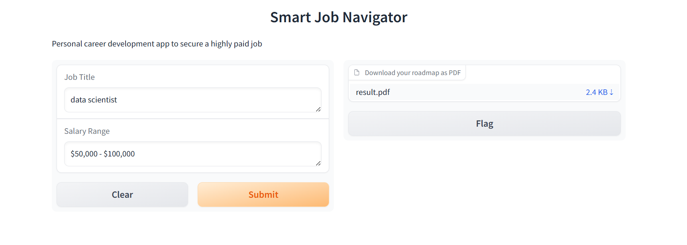

## Project Overview

### Introduction

The Smart Job Navigator is an innovative, AI-driven application designed to streamline the job search and career planning process. Leveraging the powerful capabilities of CrewAI, Gradio, and advanced language models, this application provides users with detailed career development roadmaps tailored to their desired job titles and salary ranges.
### Prerequisites

- Docker installed on your machine
- SERPER API key
- OpenAI API key

### Objectives

- **Automate Job Search**: Automatically extract and summarize key details from job descriptions.
- **Analyze Job Requirements**: Identify essential skills and certifications required for specific job roles.
- **Create Career Roadmaps**: Generate comprehensive career development plans, including timelines and recommended resources for skill acquisition and certification.

### Key Features

1. **Job Description Summarizer (Scout Agent)**
   - Extracts and summarizes key details from job descriptions, such as company names, salary ranges, essential criteria, requirements, and required certifications.

2. **Job Requirements Analyst (BluePrint Agent)**
   - Analyzes job summaries to extract essential skills and certifications, presenting this information along with the company name and salary range.

3. **Career Development Planner (SuccessJourney Agent)**
   - Assesses job requirements and generates detailed career development roadmaps, including timelines and useful resources to achieve the necessary skills and certifications.

### Project Structure

```sh
Smart Job Navigator/
├── README.md
├── results.pdf
├── Dockerfile
├── requirements.txt
├── .env
├── smart_job_navigator/
│   ├── crew.py
│   ├── gradio_app.py
│   ├── agents.py
│   ├── tasks.py
│   └── tools/
│       └── browser_tools.py
        └── search_tools.py
```

### Technology Stack

- **Python**: Core programming language for development.
- **Gradio**: Framework for building interactive web interfaces.
- **CrewAI**: Framework for orchestrating autonomous AI agents.
- **LangChain**: Language model management and interaction.
- **Docker**: For building and deploying the Gradio app.

### How It Works

1. **User Input**: The user provides a job title and salary range through the Gradio web interface.
2. **Agent Orchestration**:
   - The **Scout Agent** identifies and summarizes job opportunities.
   - The **BluePrint Agent** analyzes job descriptions to extract requirements and essential skills.
   - The **SuccessJourney Agent** generates a tailored career development roadmap.
3. **Output**: The application returns a comprehensive career plan as a downloadable PDF, helping the user navigate their career path with clarity and confidence.



### Setting Up the Project

1. **Clone the Repository**:

   ```sh
   git clone LazYavuz53/Smart-Job-navigator-with-CrewAI-Gradio.git
   cd Smart-Job-Navigator
   ```

2. **Install Dependencies**:

   ```sh
   pip install -r requirements.txt
   ```

3. **Set Environment Variables**:
   - Create a .env file with the necessary environment variables such as API keys.

4. **Run the Application**:

   ``` sh
   python smart_job_navigator/gradio_app.py
   ```
4. **Run the Application with Docker image**:
   ```sh
   docker pull yavuz53/smart-job-navigator:latest:latest
   docker run -p 7860:7860 -e SERPER_API=your_serper_api_key -e OPENAI_API=your_openai_api_key yavuz53/smart-job-navigator:latest:latest

### Usage

- **Gradio interface**: Access the Gradio web interface at http://127.0.0.1:7860 to input job titles and salary ranges, and receive detailed career roadmaps.
- **PDF output**: The career roadmap is provided as a downloadable PDF file for easy access and reference. See example "results.pdf"

### Conclusion

The Smart Job Navigator aims to revolutionize the job search and career planning landscape by providing personalized, AI-driven insights and roadmaps. With a strong foundation in CrewAI and Gradio, it offers a robust, scalable solution to help individuals achieve their career goals.
